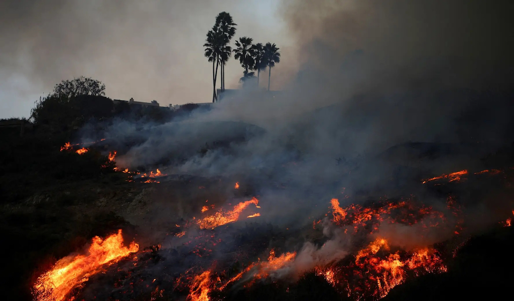

Photo Credits: Daniel Cole / Reuters

### Project Description 

The recent Los Angeles wildfires have displaced thousands of people, creating a sudden surge in demand for long-term rental housing–just as supply has drastically shrunk. According to Strategic Actions for a Just Economy, many landlords have taken advantage of this crisis by illegally inflating rental prices across the city. While some displaced residents—such as wealthy homeowners from Pacific Palisades—may be able to absorb these costs, many others cannot.

Rental price gouging will disproportionately harm economically and demographically vulnerable populations, further deepening inequalities across Los Angeles County. In this project, we seek to identify the communities or neighboroods who are most vulnerable to rental price gouging. This vulnerability, we think, is a contributor to both housing burden and displacement across the Los Angeles County.

This page demonstrates my quarter-long data and codes that wrangles, visualizes, and models spatial data in Python (from the course, UP 221: GIS and Spatial Data Science). It features my individual contributions to a group project with three other urban planning graduate students.

---

### Project Deliverables

+ [Personal Data and Codes Contributions](https://github.com/bryzenmorales/UP221-bryzen)
+ [Group Project StoryMap](https://storymaps.arcgis.com/stories/df28d89ff7b647818ddf279ec3fd321f)

---
